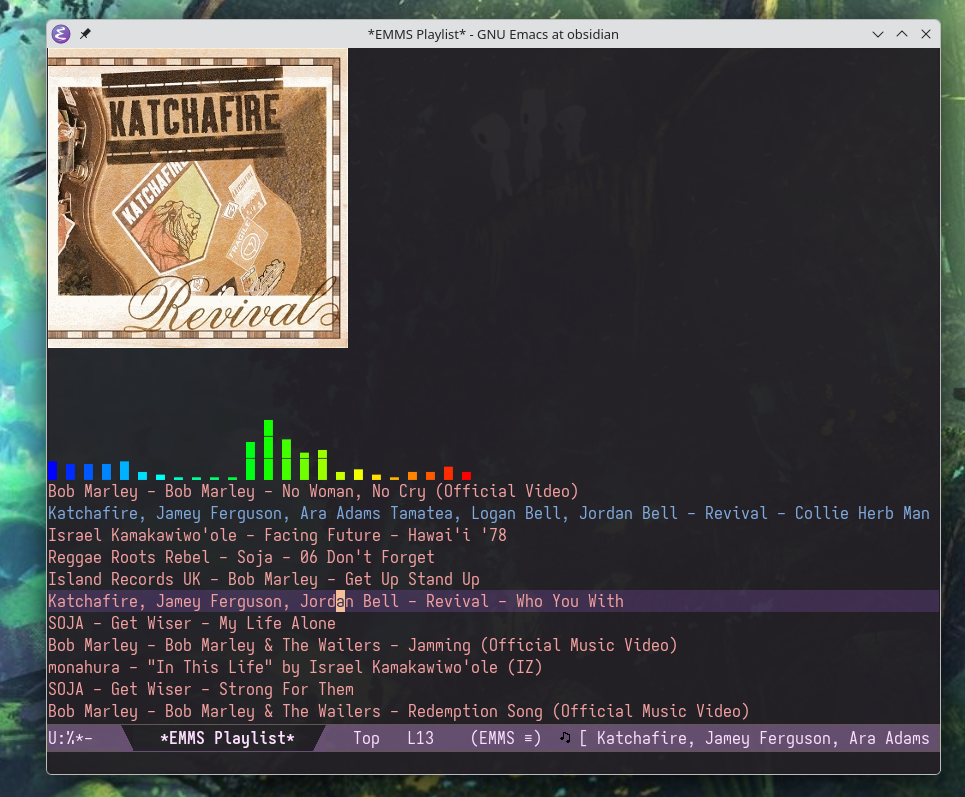

# jellyfin-emms-mpv.el

Browse and play music/video from a Jellyfin server via EMMS + mpv. Tracks playback position and reports to Jellyfin so "Continue Watching" stays in sync.

##### Music streaming via EMMS, with experimental elcava visualizer

<p align="center">
  
</p>

##### Movie & Show Galleries

<table><tr>
<td></td>
<td></td>
</tr></table>

## Requirements

- A Jellyfin server
- EMMS (music)
- mpv (video)

## Usage

| Command | Description |
|---------|-------------|
| `M-x jellyfin-browse-movies` | Pick a movie by typing in minibuffer, play in mpv |
| `M-x jellyfin-browse-movies-gallery` | Poster grid (GUI only), point and click or cursor and RET |
| `M-x jellyfin-browse-shows` | Series -> season -> episode by typing in minibuffer, plays through end of season |
| `M-x jellyfin-browse-shows-gallery` | Poster grid drill-down (GUI only), `q`/`^` to go back |
| `M-x jellyfin-browse-continue-watching` | Resume where you left off by typing in minibuffer |
| `M-x jellyfin-browse-albums` | Artist -> album by typing in minibuffer, queue in EMMS |
| `M-x jellyfin-browse-playlists` | Pick playlist by typing in minibuffer, queue in EMMS |
| `M-x jellyfin-browse-songs` | Interactive dired-like buffer: `m` mark, `u` unmark, RET queue |

With `jellyfin-completing-read-preview` enabled, minibuffer commands show poster previews as you type. Gallery commands always show posters (GUI only) and cache metadata and images to disk on first run - use the corresponding `*-refetch-metadata` command after changing media on the server.

## Installation

Add credentials to `~/.authinfo`:

```
machine your-server.example.com login USERNAME password PASSWORD
```

If your server uses a custom port (e.g. `http://your-server.example.com:8096`), include `port` in the `machine` entry:

```
machine your-server.example.com port 8096 login USERNAME password PASSWORD
```

<table><tr>
<td>

**Elpaca**
```elisp
(use-package jellyfin-emms-mpv
  :defer t
  :ensure (:host github
           :repo "emacs-os/jellyfin-emms-mpv.el")
  :config
  (setq jellyfin-server-url
        "https://your-server.example.com"
        jellyfin-completing-read-preview t
        jellyfin-preferred-language "eng"
        jellyfin-subtitles t))
```

</td>
<td>

**straight.el**
```elisp
(use-package jellyfin-emms-mpv
  :defer t
  :straight (:host github
             :repo "emacs-os/jellyfin-emms-mpv.el")
  :config
  (setq jellyfin-server-url
        "https://your-server.example.com"
        jellyfin-completing-read-preview t
        jellyfin-preferred-language "eng"
        jellyfin-subtitles t))
```

</td>
</tr></table>

### mpv

All streams are direct play (no transcoding).

```bash
# Arch
sudo pacman -S mpv

# Debian / Ubuntu
sudo apt-get install mpv

# Fedora / RHEL
sudo dnf install mpv
```

### EMMS

Example config used during development:

<table><tr>
<td>

**Elpaca**
```elisp
(use-package emms
  :ensure t
  :defer t
  :config
  (require 'emms-setup)
  (emms-all)
  (setq emms-player-list
        '(emms-player-mpv))
  (setq emms-player-mpv-parameters
        '("--no-video")))
```

</td>
<td>

**straight.el**
```elisp
(use-package emms
  :straight t
  :defer t
  :config
  (require 'emms-setup)
  (emms-all)
  (setq emms-player-list
        '(emms-player-mpv))
  (setq emms-player-mpv-parameters
        '("--no-video")))
```

</td>
</tr></table>

## Configuration

| Variable | Type | Default | Description |
|----------|------|---------|-------------|
| `jellyfin-server-url` | `string` | `nil` | Jellyfin server URL (e.g. `"https://host.example.com"`) |
| `jellyfin-completing-read-preview` | `boolean` | `nil` | `t` to show poster previews during minibuffer completion (GUI Emacs only). `jellyfin-preview` is a deprecated alias |
| `jellyfin-preferred-language` | `string` or `nil` | `nil` | ISO 639-2 three-letter audio language code: `"eng"`, `"fre"`, `"jpn"`, etc. Passed as `--alang` to mpv |
| `jellyfin-subtitles` | `boolean` | `nil` | `t` to show subtitles matching `jellyfin-preferred-language` (`--slang`). Requires `jellyfin-preferred-language` to be set |
| `jellyfin-emms-cover-art` | `boolean` | `t` | `t` to show album cover art in the EMMS playlist buffer (GUI Emacs only) |
| `jellyfin-elcava-emms-experimental` | `boolean` | `nil` | `t` to show an embedded spectrum visualizer in the EMMS playlist. Requires [elcava](https://github.com/emacs-os/elcava) + `parec`. Linux only |

## How it works

**Video** bypasses EMMS and spawns mpv directly. Playback position is tracked over mpv's IPC socket and reported to Jellyfin every 30s. Shows generate an m3u playlist from the chosen episode through end of season. Resume seeks to the saved position.

**Audio** uses EMMS normally. Track metadata (title, artist, album, track number) is set via `emms-info-functions` so it works with the playlist display, modeline, etc.
## License

MIT
